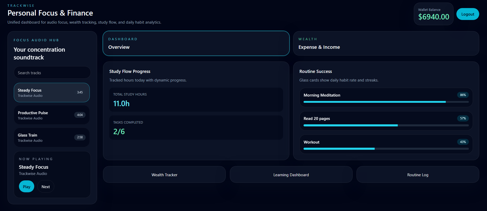

# Trackwise: Personal Focus & Finance Super-App



A unified full-stack productivity and finance dashboard combining audio focus, expense tracking, study logging, and habit analytics — all in one Glassomorphism-styled interface.

---

## Table of Contents

- [Overview](#overview)
- [Tech Stack](#tech-stack)
- [Prerequisites](#prerequisites)
- [Quick Setup (Recommended)](#quick-setup-recommended)
- [Manual Setup](#manual-setup)
- [Running the Project](#running-the-project)
- [Demo Account](#demo-account)
- [Audio Hub: Cloudinary Setup](#audio-hub-cloudinary-setup)
- [Core Modules](#core-modules)
- [Security Notes](#security-notes)
- [Folder Structure](#folder-structure)

---

## Overview

Trackwise is a monorepo full-stack application built with **Node.js/Express** on the backend and **React/Vite** on the frontend. It uses **SQLite via Prisma ORM** for persistent storage and features a dark **Glassomorphism UI** styled with Tailwind CSS.

All four modules share a single authenticated user session — your income data, habits, study sessions, and audio preferences are all tied to your account.

---

## Tech Stack

| Layer | Technology |
|---|---|
| Frontend | React 18, Vite 6, Tailwind CSS 3 |
| Charts | Recharts |
| PDF Export | jsPDF |
| Backend | Node.js, Express 4 |
| Database | SQLite (via Prisma ORM) |
| Auth | JWT (jsonwebtoken), bcryptjs |
| Audio Hosting | Cloudinary |
| Dev Tools | Concurrently, Prisma CLI |

---

## Prerequisites

- **Node.js** v18 or higher (v22 recommended)
- **npm** v9 or higher
- A **Cloudinary** account (free tier is sufficient) — only needed if you want to add your own audio tracks

---

## Quick Setup (Recommended)

These scripts install all dependencies and configure the database in one sequence.

```bash
# 1. Clone the repo
git clone <your-repo-url>
cd trackwise-super-app

# 2. Create your .env file
# On Mac/Linux:
cp .env.example .env
# On Windows (PowerShell):
Copy-Item .env.example .env

# 3. Install all dependencies (root + backend + frontend)
npm run setup

# 4. Create the database and generate the Prisma client
npm run db:push

# 5. Populate with demo data
npm run db:seed

# 6. Start both servers
npm run dev
```

The app will be available at:
- **Frontend:** http://localhost:5173
- **Backend API:** http://localhost:4000
- **Health check:** http://localhost:4000/health

---

## Manual Setup

If you prefer to install and run each part individually, or if the setup script fails:

### Step 1 — Environment

Create a `.env` file in the project root with the following content:

```env
DATABASE_URL="file:./prisma/dev.db"
JWT_SECRET="trackwise-secret"
PORT=4000
```

### Step 2 — Install Root Dependencies

```bash
cd trackwise-super-app
npm install
```

### Step 3 — Install Backend Dependencies

```bash
cd backend
npm install
cd ..
```

### Step 4 — Install Frontend Dependencies

```bash
cd frontend
npm install
cd ..
```

### Step 5 — Set Up the Database

Run from the project root (where `prisma/schema.prisma` lives):

```bash
npx prisma db push
```

This creates `prisma/dev.db` and generates the Prisma client into `node_modules/@prisma/client`.

Because the backend has its own `node_modules`, it needs its own copy of the generated client. Run this from the project root:

```bash
cd backend
npx prisma generate --schema=../prisma/schema.prisma
cd ..
```

### Step 6 — Seed Demo Data

```bash
cd backend
node seed.js
cd ..
```

### Step 7 — Start the Backend

Open a terminal and run:

```bash
cd backend
node server.js
```

The API server starts on http://localhost:4000

### Step 8 — Start the Frontend

Open a **second terminal** and run:

```bash
cd frontend
npm run dev
```

The frontend starts on http://localhost:5173

---

## Running the Project

After setup is complete, from the project root you can always start everything with one command:

```bash
npm run dev
```

This uses `concurrently` to run both the backend server and the Vite frontend simultaneously in the same terminal window.

---

## Demo Account

The seed script creates a pre-populated account with sample income, expenses, study sessions, and habits:

| Field | Value |
|---|---|
| Email | demo@trackwise.com |
| Password | password123 |

You can also register a new account from the login screen.

---

## Audio Hub: Cloudinary Setup

The Audio Hub streams audio from Cloudinary. To add your own tracks:

**Step 1 — Create a Cloudinary account**

Go to [cloudinary.com](https://cloudinary.com) and sign up for a free account.

**Step 2 — Upload your audio file**

In the Cloudinary dashboard, go to **Media Library → Upload** and upload an MP3 file. After the upload completes, click the file and copy the full URL from the **URL** field. It will look like:

```
https://res.cloudinary.com/your-cloud-name/video/upload/v1234567890/your-file.mp3
```

> Note: Cloudinary classifies audio under the "video" resource type — this is expected.

**Step 3 — Add the URL to the backend**

Open `backend/controllers/audioController.js` and add your track to the `trackList` array:

```js
const trackList = [
  {
    id: 4,
    title: 'Your Track Title',
    artist: 'Artist Name',
    album: 'Album Name',
    cloudinaryUrl: 'https://res.cloudinary.com/your-cloud-name/video/upload/v.../your-file.mp3',
    duration: '3:30'
  }
];
```

Save the file and restart the backend. The new track will appear in the Audio Hub automatically.

---

## Core Modules

### Focus Audio Hub

A dark-themed music player in the left sidebar that streams audio from **Cloudinary URLs**. Audio files are never stored locally — they are hosted on Cloudinary and referenced by URL in a constants array inside the code.

**How it works:**
- On load, the frontend fetches a track list from `GET /audio/tracks` on the backend.
- The backend returns a static array of track objects, each containing a `cloudinaryUrl` field pointing to an audio file on Cloudinary.
- The frontend's `<audio>` element uses that URL as its `src` — audio streams directly from Cloudinary.
- Controls include Play/Pause, Next, and a search bar to filter tracks by title or artist.

**Why Cloudinary?** Local MP3 files can become corrupted when moved across environments or managed by automated tools. Cloudinary provides stable, CDN-backed URLs that work reliably across all devices.

> See [Audio Hub: Cloudinary Setup](#audio-hub-cloudinary-setup) for instructions on adding your own tracks.

---

### Wealth Tracker

A full CRUD income and expense manager with live analytics.

- Add income entries with amount, source, category, and date.
- Add expense entries with amount, category, description, and date.
- Dashboard shows a **Bar Chart** (Income vs Expense) and a **Pie Chart** (spending by category).
- The **Generate Report** button exports a PDF of your financial summary directly from the browser using jsPDF — no server call needed.
- Delete individual entries from the income or expense lists.

---

### Learning Dashboard (Steady Flow)

A study-hours tracker following the "Steady Flow" approach — track topics rather than time blocks.

- Add a topic with a goal (in hours).
- Use `+0.5h` / `-0.5h` buttons to log progress as you study.
- A progress bar fills dynamically as logged hours approach the goal.
- When logged hours meet the goal, the session is auto-marked complete.
- The dashboard header shows total hours studied across all sessions.

---

### Routine Log

A daily habit tracker with visual analytics.

- Create habits with a name and a target number of days.
- Toggle today's completion status for each habit.
- Each habit card shows the last 4 log entries with color-coded completion status.
- A **Line Chart** on the right shows how many habits were completed each day over the last 7 days — giving a quick visual of your weekly consistency.

---

## Security Notes

- **Passwords** are hashed using `bcryptjs` with a salt round of 10 before being stored. Plain-text passwords are never saved to the database.
- **JWT tokens** expire after 7 days. The secret is read from the `JWT_SECRET` environment variable — change this to a long random string before any deployment.
- **Authorization middleware** protects all routes except `/auth/login` and `/auth/register`. Every request to `/wealth`, `/study`, `/habits` must include a valid `Bearer` token.
- **CORS** is enabled for local development. Before deploying, restrict it to your actual frontend domain in `backend/server.js`.
- **Helmet** is applied to all Express responses to set secure HTTP headers.
- The `.env` file is listed in `.gitignore` and should never be committed to version control.
- This project uses **SQLite** which stores data in a local file (`prisma/dev.db`). This file is also in `.gitignore`. For production use, switch to PostgreSQL or MySQL by updating the `datasource` block in `prisma/schema.prisma` and the `DATABASE_URL` in `.env`.

---

## Folder Structure

```
trackwise-super-app/
├── .env                        # Environment variables (not committed)
├── .env.example                # Template for .env
├── .gitignore
├── package.json                # Root: setup, dev, db scripts
├── prisma/
│   └── schema.prisma           # Database schema
├── backend/
│   ├── package.json
│   ├── server.js
│   ├── seed.js
│   ├── controllers/
│   │   ├── audioController.js
│   │   ├── authController.js
│   │   ├── habitController.js
│   │   ├── studyController.js
│   │   └── wealthController.js
│   ├── routes/
│   │   ├── audioRoutes.js
│   │   ├── authRoutes.js
│   │   ├── habitRoutes.js
│   │   ├── studyRoutes.js
│   │   └── wealthRoutes.js
│   ├── middleware/
│   │   └── auth.js
│   └── db/
│       └── client.js
└── frontend/
    ├── package.json
    ├── vite.config.js
    ├── tailwind.config.js
    ├── postcss.config.js
    ├── index.html
    └── src/
        ├── main.jsx
        ├── App.jsx
        ├── index.css
        ├── components/
        │   ├── AudioHub.jsx
        │   ├── WealthTracker.jsx
        │   ├── LearningDashboard.jsx
        │   └── RoutineLog.jsx
        ├── context/
        │   └── AuthContext.jsx
        └── services/
            └── api.js
```